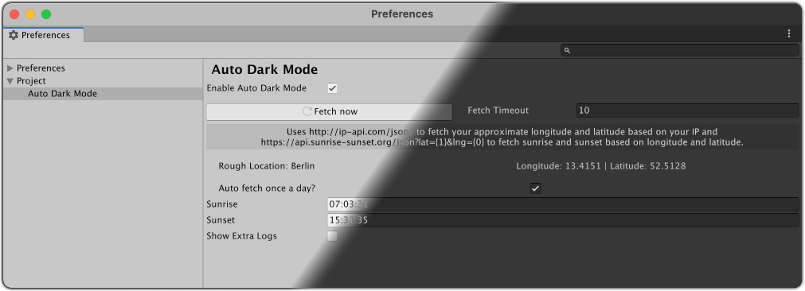

## Requirements
* Unity version 2020.1 or newer (last tested with 2020.3.1f1)
* `Api Compatibility Level` needs to be `.NET 4.x` or `.NET Core 2.0`

## Features

* Automatically toggles between the light and dark editor themes based on your current local time using
    * ... either a custom sunrise and sunset time you entered
    * ... or a automatically fetched sunrise and sunset time based on the longitude & latitude you entered

## Getting Started

Head over to your Preferences window and go to `Project/Auto Dark Mode`, here you can configure the following options:

* `Enable Auto Dark Mode`: If this is checked, the plugin will compare your _local time_* to the `Sunrise` and `Sunset` options (see below) and turn on the respective theme.
* `Auto Fetch`: If checked, the plugin will try to fetch and auto fill the `Sunrise`, `Sunset`, `Longitude` and `Latitude` options (see below) using [http://ip-api.com/json/](https://ip-api.com/docs/api:json) and [sunrise-sunset.org API](https://sunrise-sunset.org/api) once a day.
* `Fetch now` and `Fetch Timeout`: Force a fetch of the `Sunrise` and `Sunset` options (see below) now.
    * `Rough Location` and `Longitude/Latitude` (only shown if `Auto Fetch` is enabled): Fill in the longitude and latitude of your location (e.g. 52.52 and 13.4050 for Berlin, Germany). Does not need to be super accurate. This usually filled in automatically.
* `Sunrise` and `Sunset`: The _times_* when sunrise and sunset occur/when Auto Dark Mode should switch the editor theme. If `Auto Fetch` is enabled, these fields should be populated for you automatically, otherwise you have to enter them manually*.
* `Show Extra Logs`: Show some logs to know what's going on behind the scenes.

_* All times are in UTC._

## What will it add/do to my project?

* Besides the actual plugin code it will create a config file (`Assets/AutoDarkModeSettings.asset`) to store the users settings when opening the settings for the first time. It is recommended to add this to your `.gitignore` as this plugin is supposed to be configurable on a per-user level so each user needs to have their own copy.
* The plugin will hook into the [`InitializeOnLoadMethod`][1] and [`EditorApplication.projectChanged`][2] flow and try to decide if a switch of the editor theme is required and do so if needed.

## Known Issues
* Editor Theme is not applied on a per-project level: This is something Unity has to change, unfortunately the Editor theme is a global setting and can't be changed on a per-project level.

If you notice anything else that might be wrong, file an [issue](https://github.com/shniqq/unity-auto-dark-mode/issues).

## Improvement Ideas :bulb:
* :white_check_mark: ~~A way to automatically detect the user's location (long/lat). A rough estimate should be just fine to get good-enough approximations for the sunrise & sunset times.~~
* :white_check_mark: ~~Provide sensible default values for `Sunset` and `Sunrise` so the plugin works out of the box.~~
* :white_check_mark: ~~[`InitializeOnLoadMethod`][1] mostly occurs when scripts change or the project launched, for non-programmers this might not happen often enough - maybe hook into Asset Database Reload somehow or something alike?~~
* Automatically open Project Settings when plugin is added for the first time or provide a button in the welcome popup to go there.
* Add option to invert the theme (light during the night, dark during the day). Not sure if this is something someone actually wants?

**PRs are welcome!**

[1]: https://docs.unity3d.com/ScriptReference/InitializeOnLoadMethodAttribute.html
[2]: https://docs.unity3d.com/ScriptReference/EditorApplication-projectChanged.html
